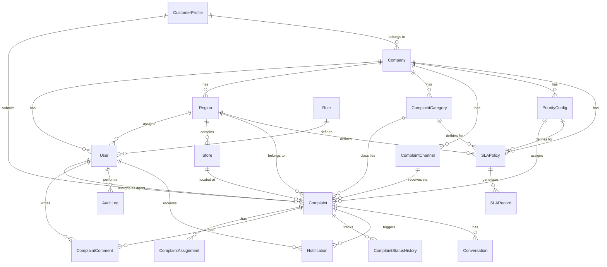
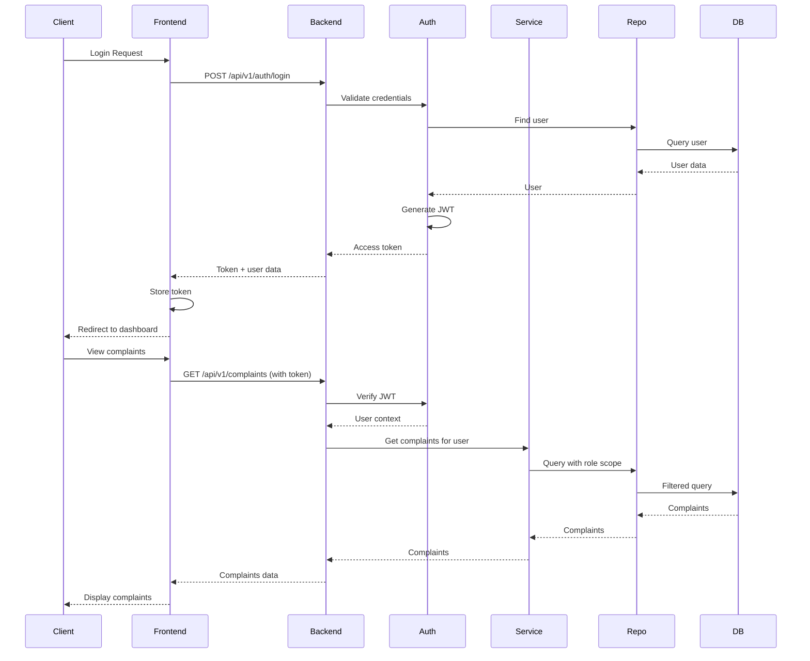
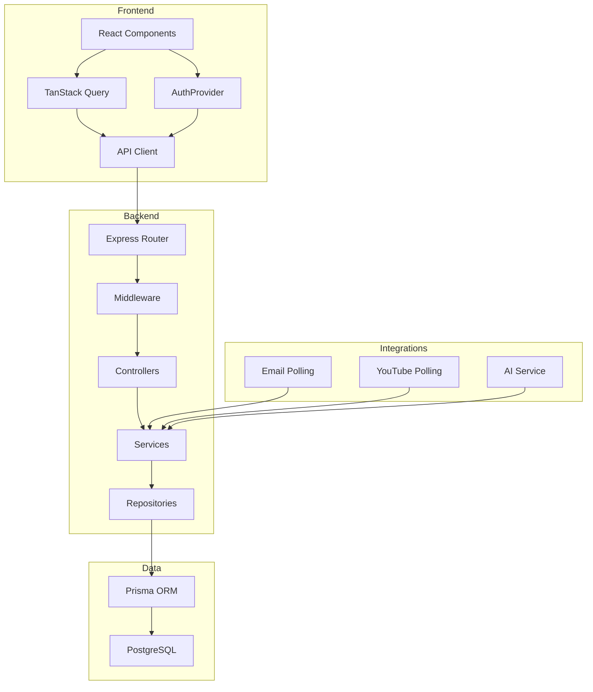

# Centralised Customer Complaint Management Platform

A full-stack system for managing customer complaints across multiple channels. Built for retail organizations to track, assign, prioritize, and resolve customer issues efficiently.

## What is this project?

This is a **complaint management system** that helps organizations:
- Collect complaints from customers (website, email, YouTube)
- Assign complaints to agents for resolution
- Track response times with SLA (Service Level Agreement) monitoring
- Analyze patterns to identify recurring issues
- Provide role-based access for different user types

**It's not a demo** - it's a production-ready application with real database storage, authentication, and business logic.

---

## High-Level Design (HLD)

### System Overview

```
┌─────────────────┐         ┌─────────────────┐         ┌─────────────────┐
│   Frontend      │         │   Backend API   │         │   Database      │
│   (React)       │◄────────►│   (Express)     │◄────────►│   (PostgreSQL)  │
│   Port: 5173    │  HTTP   │   Port: 4000    │  Prisma  │   Port: 5433    │
└─────────────────┘         └─────────────────┘         └─────────────────┘
                                      │
                                      │
                    ┌─────────────────┼─────────────────┐
                    │                 │                 │
                    ▼                 ▼                 ▼
              ┌──────────┐    ┌──────────┐    ┌──────────┐
              │   Email  │    │  YouTube │    │    AI    │
              │  Polling │    │  Polling │    │ Service  │
              └──────────┘    └──────────┘    └──────────┘
```

### Architecture Layers

**1. Presentation Layer (Frontend)**
- React 19 with TypeScript
- Vite for fast development
- TanStack Query for data fetching
- Tailwind CSS for styling
- Role-based dashboards

**2. API Layer (Backend)**
- Express.js REST API
- JWT authentication with refresh tokens
- Role-based access control (RBAC)
- Request validation with Zod
- Rate limiting for security

**3. Data Layer**
- Prisma ORM for database operations
- PostgreSQL for data storage
- Multi-tenant support with company scoping

**4. Integration Layer**
- Email polling (IMAP) for automatic complaint creation
- YouTube API for comment monitoring
- AI service for smart suggestions (OpenAI or mock)

### User Roles

| Role | Access Level | Responsibilities |
|------|-------------|-------------------|
| **Customer** | Own complaints only | Submit and track their complaints |
| **Agent** | Assigned complaints | Resolve assigned complaints, add comments |
| **Operations Manager** | All company complaints | Assign work, view analytics |
| **Regional Manager** | Region-specific | Manage complaints in their region |
| **Admin** | Full access | Manage users, regions, categories, SLA policies |
| **Super Admin** | Full access | All admin capabilities |

---

## Low-Level Design (LLD)

### Database Schema (ER Diagram)

**Mermaid Diagram (renders in GitHub, GitLab, etc.):**



**ASCII Version:**

```
┌─────────────┐
│   Company   │
└──────┬──────┘
       │
       ├──────────────────┬──────────────────┬──────────────────┬──────────────────┬──────────────────┐
       ▼                  ▼                  ▼                  ▼                  ▼                  ▼
┌─────────────┐    ┌─────────────┐    ┌──────────────────┐ ┌──────────────────┐ ┌──────────────────┐ ┌──────────────────┐
│    User     │    │   Region    │    │ ComplaintCategory │ │ ComplaintChannel │ │  PriorityConfig  │ │    SLAPolicy     │
└──────┬──────┘    └──────┬──────┘    └────────┬─────────┘ └────────┬─────────┘ └────────┬─────────┘ └────────┬─────────┘
       │                  │                    │                    │                    │                    │
       │                  │                    │                    │                    │                    │
       │                  ├──────────┬─────────┤                    │                    │                    │
       │                  │          │         │                    │                    │                    │
       ▼                  ▼          ▼         ▼                    ▼                    ▼                    ▼
┌─────────────┐    ┌─────────────┐  ┌─────────────┐    ┌─────────────┐    ┌─────────────┐    ┌─────────────┐
│    Role     │    │    Store    │  │  Complaint  │    │  Complaint  │    │  Complaint  │    │   SLARecord  │
└─────────────┘    └─────────────┘  └──────┬──────┘    └─────────────┘    └─────────────┘    └─────────────┘
                                         │
                                         │
                       ┌─────────────────┼─────────────────┬─────────────────┐
                       │                 │                 │                 │
                       ▼                 ▼                 ▼                 ▼
              ┌─────────────┐  ┌─────────────┐  ┌─────────────┐  ┌─────────────┐
              │   Comment   │  │ Assignment  │  │ StatusHist  │  │ Notification │
              └─────────────┘  └─────────────┘  └─────────────┘  └─────────────┘

┌─────────────────┐
│ CustomerProfile │───┬─── Complaint
└─────────────────┘   │
                       └─── Company
```

### API Request Flow

**Mermaid Diagram:**



**ASCII Version:**

```
LOGIN FLOW:
┌──────────┐      ┌──────────┐      ┌──────────┐      ┌──────────┐      ┌──────────┐      ┌──────────┐
│  Client  │─────▶│ Frontend │─────▶│ Backend  │─────▶│   Auth   │─────▶│   Repo   │─────▶│    DB    │
└──────────┘      └──────────┘      └──────────┘      └──────────┘      └──────────┘      └──────────┘
                      │                    │                    │                    │                    │
                      │                    │                    │◀───────────────────│◀───────────────────│
                      │                    │                    │                    │                    │
                      │◀───────────────────│◀───────────────────│                    │                    │
                      │                    │                    │                    │                    │
                      │                    │                    │───────────────────▶│                    │
                      │                    │                    │                    │                    │
                      │                    │                    │◀───────────────────│                    │
                      │                    │                    │                    │                    │
                      │◀───────────────────│◀───────────────────│                    │                    │
                      │                    │                    │                    │                    │
                      │                    │                    │                    │                    │

DATA FETCH FLOW:
┌──────────┐      ┌──────────┐      ┌──────────┐      ┌──────────┐      ┌──────────┐      ┌──────────┐
│  Client  │─────▶│ Frontend │─────▶│ Backend  │─────▶│   Auth   │─────▶│  Service │─────▶│   Repo   │─────▶│    DB    │
└──────────┘      └──────────┘      └──────────┘      └──────────┘      └──────────┘      └──────────┘      └──────────┘
                      │                    │                    │                    │                    │                    │
                      │                    │                    │◀───────────────────│                    │                    │
                      │                    │                    │                    │                    │
                      │                    │                    │───────────────────▶│───────────────────▶│
                      │                    │                    │                    │                    │
                      │                    │                    │◀───────────────────│◀───────────────────│◀───────────────────│
                      │                    │                    │                    │                    │
                      │◀───────────────────│◀───────────────────│                    │                    │
                      │                    │                    │                    │                    │
```

### Component Architecture

**Mermaid Diagram:**



**ASCII Version:**

```
┌─────────────────────────────────────────────────────────────────────────────────────────┐
│                              FRONTEND LAYER                                              │
│  ┌──────────────┐    ┌──────────────┐    ┌──────────────┐    ┌──────────────┐         │
│  │   React UI   │───▶│ AuthProvider │───▶│ TanStack Qry │───▶│  API Client  │         │
│  └──────────────┘    └──────────────┘    └──────────────┘    └──────┬───────┘         │
│                                                                           │               │
└───────────────────────────────────────────────────────────────────────────┼───────────────┘
                                                                            │ HTTP
                                                                            ▼
┌─────────────────────────────────────────────────────────────────────────────────────────┐
│                              BACKEND LAYER                                               │
│                                                                           │               │
│  ┌──────────────┐    ┌──────────────┐    ┌──────────────┐    ┌──────────────┐         │
│  │   Express    │◀───│  Middleware  │◀───│ Controllers  │◀───│   Services   │         │
│  │    Router    │    │ (Auth/Valid) │    │              │    │              │         │
│  └──────────────┘    └──────────────┘    └──────┬───────┘    └──────┬───────┘         │
│                                           │                    │                    │
│                                           │                    │                    │
│                                           ▼                    ▼                    │
│                                  ┌──────────────┐    ┌──────────────┐               │
│                                  │ Repositories │───▶│   Prisma ORM │               │
│                                  └──────────────┘    └──────┬───────┘               │
└───────────────────────────────────────────────────────────────────┼───────────────────┘
                                                                            │
                                                                            ▼
┌─────────────────────────────────────────────────────────────────────────────────────────┐
│                              DATA LAYER                                                  │
│                                                                           │               │
│  ┌──────────────────────────────────────────────────────────────────────┐              │
│  │                         PostgreSQL                                    │              │
│  └──────────────────────────────────────────────────────────────────────┘              │
└─────────────────────────────────────────────────────────────────────────────────────────┘

┌─────────────────────────────────────────────────────────────────────────────────────────┐
│                         INTEGRATION LAYER                                                │
│                                                                           │               │
│  ┌──────────────┐    ┌──────────────┐    ┌──────────────┐    ┌──────────────┐         │
│  │ Email Polling│───▶│YouTube Poll  │───▶│  AI Service  │───▶│  Storage     │         │
│  │  (IMAP)      │    │   (API)      │    │ (OpenAI/Mock)│    │  (Local/S3)  │         │
│  └──────────────┘    └──────────────┘    └──────────────┘    └──────────────┘         │
│                                                                           │               │
└───────────────────────────────────────────────────────────────────────────┼───────────────┘
                                                                            │
                                                                            ▼
                                                                    ┌──────────────┐
                                                                    │  Services    │
                                                                    └──────────────┘
```

### Database Schema

**Core Entities:**
- **User** - System users with roles and assignments
- **Complaint** - Customer complaints with status tracking
- **CustomerProfile** - Customer contact information
- **Region** - Geographic regions for organization
- **Store** - Physical store locations
- **ComplaintCategory** - Types of complaints (Billing, Product Quality, etc.)
- **ComplaintChannel** - Source channels (Website, Email, YouTube)
- **PriorityConfig** - Priority levels (Low, Medium, High, Critical)
- **SLAPolicy** - Service level agreement rules
- **Notification** - In-app notifications
- **AuditLog** - System activity tracking

**Key Relationships:**
- Complaint → Customer (many-to-one)
- Complaint → AssignedAgent (many-to-one)
- Complaint → Region (many-to-one)
- Complaint → Store (many-to-one)
- User → Role (many-to-one)
- Region → Company (many-to-one for multi-tenancy)

### API Endpoints

**Authentication:**
- `POST /api/v1/auth/register` - Register new user
- `POST /api/v1/auth/login` - Login with email/password
- `POST /api/v1/auth/refresh` - Refresh access token
- `GET /api/v1/auth/me` - Get current user info
- `POST /api/v1/auth/logout` - Logout

**Complaints:**
- `GET /api/v1/complaints` - List complaints (filtered by role)
- `POST /api/v1/complaints` - Create new complaint
- `GET /api/v1/complaints/:id` - Get complaint details
- `PATCH /api/v1/complaints/:id` - Update complaint
- `POST /api/v1/complaints/:id/assign` - Assign to agent
- `POST /api/v1/complaints/:id/comments` - Add comment

**Dashboard:**
- `GET /api/v1/dashboard/summary` - Complaint statistics
- `GET /api/v1/dashboard/trends` - Complaint trends over time
- `GET /api/v1/dashboard/by-category` - Breakdown by category
- `GET /api/v1/dashboard/sla` - SLA compliance metrics

**Admin:**
- `GET /api/v1/admin/users` - List users
- `POST /api/v1/admin/users` - Create user
- `GET /api/v1/admin/regions` - List regions
- `POST /api/v1/admin/regions` - Create region
- `GET /api/v1/admin/categories` - List categories
- `GET /api/v1/admin/sla-policies` - List SLA policies

### Complaint Lifecycle

```
NEW → CATEGORISED → ASSIGNED → IN_PROGRESS → RESOLVED → CLOSED
                     ↓              ↓
                  REOPENED      ESCALATED
```

**Status Rules:**
- `NEW` - Complaint received, not yet categorized
- `CATEGORISED` - Category and priority assigned
- `ASSIGNED` - Agent assigned to handle
- `IN_PROGRESS` - Agent actively working
- `RESOLVED` - Solution provided
- `CLOSED` - Customer accepted, case closed
- `REOPENED` - Customer reopened after resolution
- `ESCALATED` - Escalated to higher level

### SLA Monitoring

**SLA Calculation:**
- Response time: Time from creation to first agent response
- Resolution time: Time from creation to resolution
- Escalation threshold: Time before auto-escalation

**SLA Status:**
- `ON_TRACK` - Within SLA limits
- `APPROACHING` - Near deadline (80% of time used)
- `OVERDUE` - Past deadline
- `MET` - Resolved within SLA
- `BREACHED` - Resolved after SLA deadline

### Security Features

**Authentication:**
- JWT access tokens (15 min expiry)
- HTTP-only refresh cookies (7 day expiry)
- bcrypt password hashing
- Secure cookie settings in production

**Authorization:**
- Role-based access control (RBAC)
- Scoped queries by user role
- Region-based filtering for regional managers
- Company-based multi-tenancy

**Rate Limiting:**
- General API: 300 requests per 15 min
- Auth endpoints: 20 requests per 15 min

---

## Technology Stack

**Frontend:**
- React 19
- TypeScript
- Vite
- TanStack Query (React Query)
- React Hook Form
- Zod (validation)
- Recharts (charts)
- Tailwind CSS
- Lucide Icons

**Backend:**
- Node.js 22
- Express 5
- TypeScript
- Prisma ORM
- PostgreSQL 16
- JWT (jsonwebtoken)
- bcrypt
- Helmet (security headers)
- CORS
- express-rate-limit

**Integrations:**
- IMAP (email polling)
- YouTube Data API
- OpenAI API (optional)

---

## Installation & Setup

### Prerequisites
- Node.js 22+
- Docker (for PostgreSQL)
- Git

### Step 1: Clone and Install

```bash
git clone <repository-url>
cd complaint-management-platform
npm install
```

### Step 2: Environment Setup

```bash
cp .env.example .env
```

Edit `.env` with your settings. Key variables:
- `DATABASE_URL` - PostgreSQL connection string
- `JWT_SECRET` - Secret for JWT signing
- `JWT_REFRESH_SECRET` - Secret for refresh tokens
- `CLIENT_URL` - Frontend URL (http://localhost:5173)

### Step 3: Start Database

```bash
docker compose up -d postgres
```

This starts PostgreSQL on port 5433.

### Step 4: Run Migrations

```bash
cd backend
npx prisma migrate dev --name init
npx prisma db seed
cd ..
```

Seed creates:
- Default company
- User roles
- Default region, category, channels, priorities
- Demo users (admin, agent, manager, customer)

### Step 5: Run Development Servers

```bash
# Terminal 1 - Backend
npm run dev:backend

# Terminal 2 - Frontend
npm run dev:frontend
```

Or run both at once:
```bash
npm run dev
```

**Access:**
- Frontend: http://localhost:5173
- Backend API: http://localhost:4000
- API Docs: http://localhost:4000/docs
- Health Check: http://localhost:4000/health

---

## Demo Credentials

All demo users use password: **`DemoPass123!`**

| Role | Email | Purpose |
|------|-------|---------|
| Super Admin | admin@example.com | Full system access |
| Agent | agent@example.com | Handle assigned complaints |
| Operations Manager | manager@example.com | Manage all complaints |
| Customer | customer@example.com | Submit and track complaints |

---

## Channel Integrations

### Email Integration

Configure in `.env`:
```
EMAIL_USER=your-email@gmail.com
EMAIL_PASSWORD=your-app-password
EMAIL_IMAP_HOST=imap.gmail.com
EMAIL_IMAP_PORT=993
```

The system polls for new emails every 10 seconds and automatically creates complaints.

### YouTube Integration

Configure in `.env`:
```
YOUTUBE_API_KEY=your-api-key
YOUTUBE_CHANNEL_IDS=channel-id-1,channel-id-2
```

The system monitors YouTube comments and creates complaints from customer issues.

---

## AI Features

**Default:** Mock AI (keyword-based suggestions, no external API)

**To use OpenAI:**
```
AI_PROVIDER=OPENAI
AI_API_KEY=your-openai-api-key
AI_MODEL=gpt-4o-mini
```

AI provides:
- Suggested complaint category
- Suggested priority level
- Draft response for customers
- Next steps recommendation

**Note:** AI suggestions are never sent automatically. Agents must review and accept before sending.

---

## Testing

```bash
npm test              # Run all tests
npm run lint          # Check code style
npm run typecheck     # TypeScript type checking
npm run build         # Build for production
```

---

## Docker Deployment

```bash
docker compose up --build
```

Access:
- Web: http://localhost:8080
- API: http://localhost:4000

---

## Production Considerations

- Replace demo users with real accounts
- Update SLA policies for business needs
- Use managed PostgreSQL (AWS RDS, etc.)
- Enable HTTPS/TLS
- Use S3 or similar for file storage
- Set strong JWT secrets
- Configure proper CORS origins
- Enable monitoring and logging
- Use `prisma migrate deploy` for migrations

---

## Project Structure

```
complaint-management-platform/
├── backend/
│   ├── prisma/
│   │   ├── schema.prisma      # Database schema
│   │   ├── migrations/        # Database migrations
│   │   └── seed.ts            # Seed data
│   ├── src/
│   │   ├── config/            # Configuration
│   │   ├── controllers/       # Request handlers
│   │   ├── services/          # Business logic
│   │   ├── repositories/      # Data access
│   │   ├── middleware/        # Express middleware
│   │   ├── routes/            # API routes
│   │   ├── integrations/      # External integrations
│   │   └── utils/             # Utilities
│   └── tests/                 # Backend tests
├── frontend/
│   ├── src/
│   │   ├── api/               # API client
│   │   ├── auth/              # Authentication
│   │   ├── components/        # React components
│   │   ├── pages/             # Page components
│   │   ├── hooks/             # Custom hooks
│   │   └── lib/               # Utilities
│   └── tests/                 # Frontend tests
├── docs/                      # Documentation
├── docker-compose.yml         # Docker services
└── README.md                  # This file
```

---

## Key Features

✅ **Multi-channel support** - Website, Email, YouTube  
✅ **Role-based access** - Different views for different users  
✅ **SLA monitoring** - Track response and resolution times  
✅ **Auto-escalation** - Escalate overdue complaints  
✅ **AI assistance** - Smart suggestions for agents  
✅ **Analytics** - Identify recurring issues  
✅ **Audit logging** - Track all system changes  
✅ **Multi-tenant** - Support multiple companies  
✅ **Real-time updates** - Polling for new data  
✅ **Secure** - JWT auth, rate limiting, input validation
